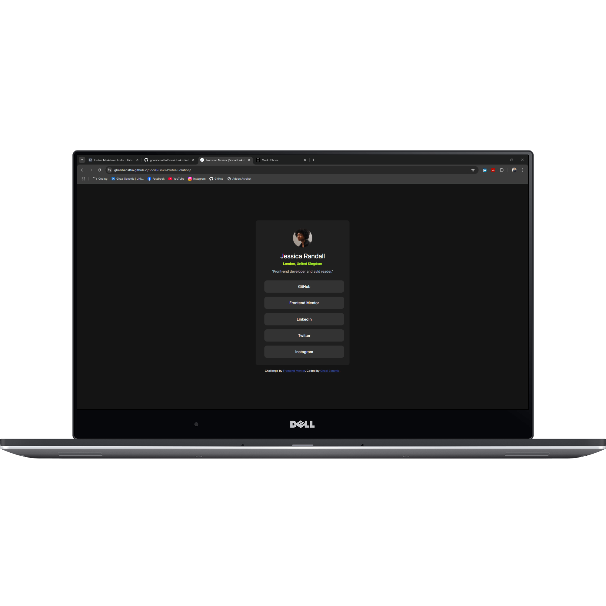
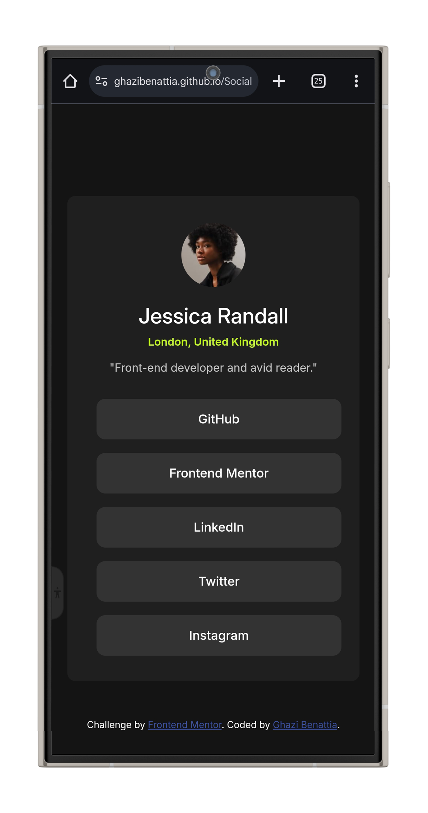
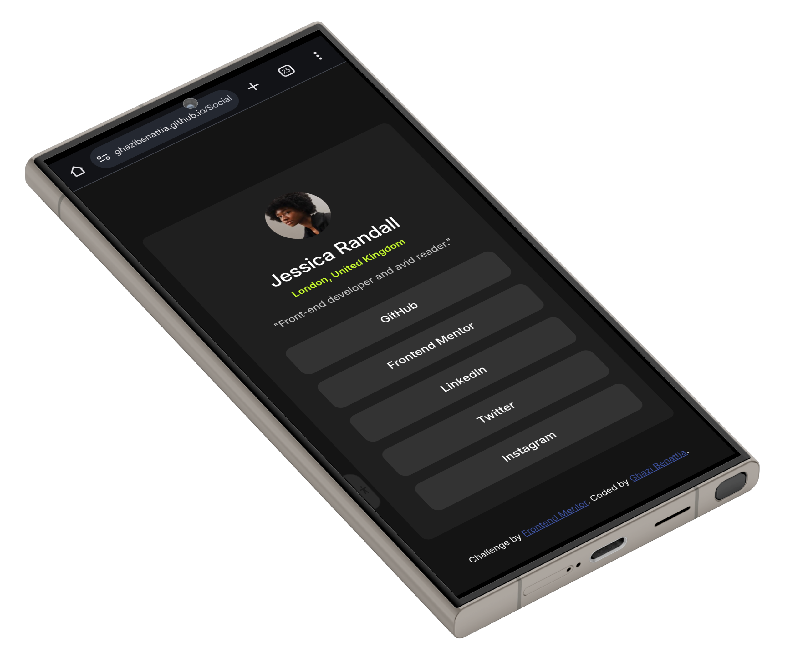

# Frontend Mentor - QR code component solution by Ghazi Benattia
This is a solution to the [Social Links Profile Challenge](https://www.frontendmentor.io/challenges/social-links-profile-UG32l9m6dQ). 
Frontend Mentor challenges help you improve your coding skills by building realistic projects. 
***
## Table of contents
- [Overview](#overview)
  - [Screenshots](#screenshots)
  - [Links](#links)
- [My process](#my-process)
  - [Built with](#built-with)
  - [What I learned](#what-i-learned)
  - [Continued development](#continued-development)
  - [Useful resources](#useful-resources)
- [Author](#author)
- [Acknowledgments](#acknowledgments)
***
## Overview
Here's my solution to the "Social Links Profile" challenge on FrontEnd Mentor.
***
### Screenshots
- How the website looks like in your laptop browser:

- Multiple phone design of the website:


---

### Links
- Solution URL: [Github repository](https://github.com/ghazibenattia/Social-Links-Profile-Solution.git)
- Live Site URL: [Live site using Github pages](https://ghazibenattia.github.io/Social-Links-Profile-Solution/)

---
## My process
I built this profile card as part of the Frontend Mentor challenge to practice my frontend skills. I focused on creating a clean, modern design using HTML and CSS. I started with structuring the content, ensuring everything was accessible, and then added styles for a sleek, responsive layout. The hardest part was making sure the buttons were properly aligned and responsive across different screen sizes. Overall, it was a great opportunity to improve my design and coding skills.

---
### Built with
- **Technologies and languages:**
    - **HTML5:** Used to structure the content of the webpage, including the card layout, image, text, and author details.
    - **CSS3:** Used for styling the page and the card, including typography, color schemes, and layout techniques.
    - **Google Fonts:** Used the 'Inter' font family from Google Fonts to enhance typography.
- **Techniques:**
   - **Flexbox Layout:** Applied within the *"#container"* and avatar sections to align and center content both horizontally and vertically. This ensures the profile card and other sections are neatly arranged.
   - **Responsive Design:** Using media queries (@media) to ensure the profile card adapts to different screen sizes, such as adjusting the width of the container for smaller devices.
   - **Typography:** Implemented custom fonts from Google Fonts (the 'Inter' family) to enhance text readability and style. You also used font size, weight, and line spacing to make the text clear and visually appealing.
   - **CSS Grid:** Used in the *".links ul"* to layout the buttons in a grid format, providing uniform spacing and alignment.s.
   - **Button Styling and Hover Effects:** Buttons were styled with a clean and modern look, including a background color change on hover for interactivity. The *":hover"* pseudo-class was used to change button colors when hovered over.
   - **Border-Radius and Spacing:** Used to create rounded corners for buttons and the profile card itself, making the design feel softer and more polished. Margin and padding were adjusted to create consistent spacing throughout the card.

---

### What I learned
Through this project, I learned how to structure and style a responsive profile card using HTML and CSS. I gained hands-on experience with Flexbox and CSS Grid to create a flexible layout that adapts to different screen sizes. I also worked with custom typography from Google Fonts to enhance text presentation and used button styling techniques, including hover effects, to improve user interaction. Additionally, I learned how to implement media queries for responsive design and used border-radius and spacing to create a polished, modern look.

---

### Code snippets
These code snippets below highlight key techniques such as Flexbox, responsive design, custom fonts, hover effects, and more, which I used to build a clean, responsive, and visually appealing blog preview card.
**1.** **HTML: Avatar Section:**
```html
<div class="avatar">
  
</div>
```
**In this snippet, I created an *"avatar"* section that contains an image tag. The image is given a class for styling, making it easy to control its size and appearance using CSS.**

---
**2.** **CSS: Avatar Styling:**
```css
.avatar img {
  height: 5.1rem;
  border-radius: 50%;
  margin-bottom: 1rem;
  margin-top: 1.5rem;
}
```
**Here, I styled the avatar image to be circular using *"border-radius: 50%"*. I also set the size with *"height"* and added margin for spacing above and below the image.**

---
**3.** **HTML: Links Section (Buttons):**
```html
<div class="links">
  <ul>
    <li><a href="https://github.com/"><button>GitHub</button></a></li>
    <li><a href="https://www.frontendmentor.io/"><button>Frontend Mentor</button></a></li>
  </ul>
</div>
```
**In this section, I created a list of social media links, each wrapped in a button tag for clickable functionality. Each list item *(li)* contains a button with a corresponding link inside the anchor *(a)* tag.**

---
**4.** **CSS: Links Styling (Buttons):**
```css
.links button {
  color: hsl(0, 0%, 100%);
  width: 100%;
  padding: 1rem;
  background-color: hsl(0, 0%, 20%);
  margin: 7px;
  border-radius: 0.7rem;
  cursor: pointer;
}
```
**I styled the buttons to have a white text color, dark background, and rounded corners. I set the width to 100% to make the buttons expand to fit their container and added padding for a better user experience.**

---
**5.** **CSS: Button Hover Effect:**
```css
.links button:hover {
  background-color: hsl(75, 94%, 57%);
  color: hsl(0, 0%, 8%);
}
```
**I added a hover effect for the buttons. When the user hovers over the button, the background color changes to a green shade, and the text color switches for better contrast.**

---
**6. CSS: Responsive Design (Media Query):**
```css
@media screen and (max-width: 500px) {
  #container {
    width: 90%;
    margin: 2rem auto;
  }
}
```
**I used a media query to make the profile card responsive. On screens smaller than 500px, the container's width is reduced to 90%, and I applied a margin to center it and add spacing around the card.**

---
**7. CSS: Container Styling:**
```css
#container {
  width: 400px;
  height: 615px;
  background-color: hsl(0, 0%, 12%);
  border-radius: 10px;
  text-align: center;
  display: flex;
  flex-direction: column;
  padding: 10px;
}
```
**I styled the main container to give it a fixed width and height, a dark background color, and rounded corners. Using Flexbox, I set the layout to be vertically aligned with *"flex-direction: column"*.**

---
**8. CSS: Attribution Section Styling:**
```css
.attribution {
  font-size: 12px;
  text-align: center;
  margin-top: 1rem;
  color: hsl(0, 0%, 100%);
}
```
**For the attribution section, I used small text, centered it, and added a top margin to space it from the content above. I also styled the text to be white to match the rest of the page's design.**

---
### Continued development
For my continued development, I plan to focus on expanding my knowledge in front-end technologies by exploring more advanced CSS techniques like animations and transitions. I also want to deepen my understanding of JavaScript and its frameworks to enhance the interactivity of my projects. Additionally, I aim to improve my problem-solving skills by working on more complex challenges and contributing to open-source projects. Gaining more experience with responsive design and accessibility will be a priority as well, ensuring my websites are user-friendly and accessible to all.

---
### Useful resources
- [**Markdown Guide - Basic Syntax**](https://www.markdownguide.org/basic-syntax/) - This guide helped me learn how to format text in Markdown, including creating lists, links, and headers. It was essential for writing clear and structured documentation for my projects.
- [**Google Fonts**](https://fonts.google.com/) - I used Google Fonts to browse and integrate stylish fonts into my projects. It helped me improve the visual appeal of my work by giving me access to a variety of web-safe fonts.
- [**W3Schools CSS Display Property Reference**](https://www.w3schools.com/cssref/pr_class_display.php) - I referred to this resource when I needed to understand how different **display** properties work in CSS. It helped me structure my layouts effectively using values like **block**, **inline**, **flex**, and **grid**.
- [**web.dev Learn CSS**](https://web.dev/learn/css/) - This resource helped me dive deeper into CSS. I learned about layout techniques, responsive design, and how to write clean, efficient styles for my projects.
- [**web.dev Learn HTML**](https://web.dev/learn/html/) - This guide helped me understand the structure of web pages by teaching me about HTML elements and attributes. It gave me the knowledge to create semantic and accessible web pages.
---

## Author
- Github - [**Ghazi Benattia**](https://github.com/ghazibenattia)
- Frontend Mentor - [**@ghazibenattia**](https://www.frontendmentor.io/profile/ghazibenattia)
---

## Acknowledgments
I would like to express my appreciation for the opportunity to work on this project. It has been a great learning experience where I applied my skills in HTML and CSS while gaining insights into responsive design and styling techniques. This project has allowed me to enhance my understanding of web development and has motivated me to continue exploring and growing in the field.